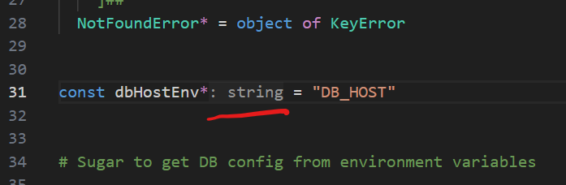
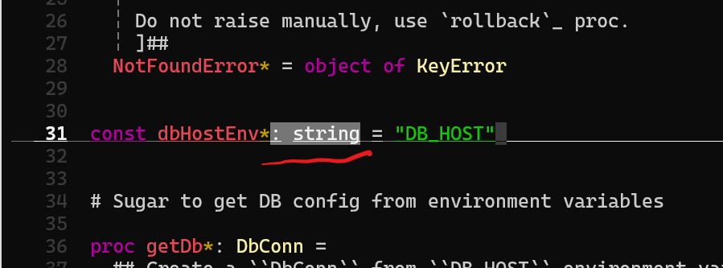
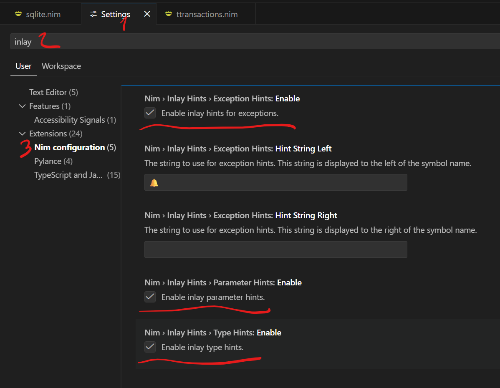

# Nim Language Server

Nim Language Server, or `nimlangserver`, is a language server for Nim.

`nimlangserver` can run in two server modes:

- **LSP server** for editors and IDEs.
- **MCP server** for AI tools and coding agents such as GitHub Copilot, Claude Code, and Gemini.

LSP is the default mode. Running `nimlangserver` is equivalent to `nimlangserver --lsp`.

## Installation

**IMPORTANT** you might want to use latest build of the `nimlangserver` and/or build it from source.

`nimlangserver` requires `nimble >= 0.16.1`

### Installing binaries

_NB:_ `nimlangserver` requires `nimsuggest` version that supports `--v3`:

- `devel` containing [19826](https://github.com/nim-lang/Nim/pull/19826)
- 1.6+ containing [19892](https://github.com/nim-lang/Nim/pull/19892)

You can install the latest release into `$HOME/.nimble/bin` using e.g.:

```sh
nimble install -g nimlangserver
```

### From Source

```bash
nimble build
```

## Server modes and transports

`nimlangserver` supports two transports in both modes:

- `--stdio` (default)
- `--socket`

To use socket transport, start `nimlangserver` with `--socket`. You can set the port using `--port=<port>`. If you don't specify a port, `nimlangserver` will automatically find an open port and print it to the console.

## LSP server

### Setup

**IMPORTANT** if you're a Windows user, do youself a favor and set up your development environment in [WSL](https://learn.microsoft.com/en-us/windows/wsl/), i.e. clone and edit your projects in the WSL file system. If you use VSCode, use it with [WSL extension](https://marketplace.visualstudio.com/items?itemName=ms-vscode-remote.remote-wsl), and run terminal-based editors like Neovim or Helix directly in the WSL shell. Even though nimlangserver does compile and work natively on Windows, you will enjoy better performance and stability in WSL mode.

By default, `nimlangserver` starts in LSP mode over stdio:

```bash
nimlangserver
```

These commands are equivalent:

```bash
nimlangserver
nimlangserver --lsp
nimlangserver --lsp --stdio
```

To run the LSP server over a socket instead:

```bash
nimlangserver --lsp --socket --port=6000
```

#### VSCode

- [vscode-nim](https://github.com/nim-lang/vscode-nim) has support for `nimlangserver`. Follow the instructions at:
  https://github.com/nim-lang/vscode-nim#using

#### Sublime Text

Install [LSP-nimlangserver](https://packagecontrol.io/packages/LSP-nimlangserver) from Package Control.

#### Zed Editor

Install [Nim Extenstion](https://github.com/foxoman/zed-nim) from the Zed Editor extensions.

#### Helix

Just install the langserver with Nimble and make sure it's on your PATH.

To verify that everything is set up, run:

```shell
$ hx --health nim
Configured language servers:
  ✓ nimlangserver: /home/username/.nimble/bin/nimlangserver
  Configured debug adapter: None
  Configured formatter:
    ✓ /home/username/.nimble/bin/nph
    Tree-sitter parser: ✓
    Highlight queries: ✓
    Textobject queries: ✓
    Indent queries: ✓
```

#### Neovim

- [lsp](https://neovim.io/doc/user/lsp.html) Neovim has built-in LSP support. Although, you might want to use something like [lsp-config](https://github.com/neovim/nvim-lspconfig) to take care of the boilerplate code for the most LSP configurations. Install `lsp-config` using your favourite plugin manager an place the following code into your `init.vim` config:

```lua
lua <<EOF

require'lspconfig'.nim_langserver.setup{
  settings = {
    nim = {
      nimsuggestPath = "~/.nimble/bin/custom_lang_server_build"
    }
  }
}

EOF
```

Change configuration to your liking (most probably you don't need to provide any settings at all, defaults should work fine for the majority of the users). You might also want to read `lsp-config` documentation to setup key bindings, autocompletion and so on.

#### VIM/Neovim

- [coc.nvim](https://github.com/neoclide/coc.nvim) supports both classical VIM as well as Neovim. It also supports vscode-like `coc-settings.json` for LSP configuration. Install the plugin via your favourite plugin manager, create `coc-settings.json` alongside your `init.vim` and add the following contents to it:

```json
{
  "languageserver": {
    "nim": {
      "command": "nimlangserver",
      "filetypes": ["nim"],
      "trace.server": "verbose",
      "settings": {
        "nim": {
          "nimsuggestPath": "~/.nimble/bin/nimsuggest"
        }
      }
    }
  }
}
```

Of course, change the configuration to your liking. You might also want to read `coc.nvim` documentation to setup key bindings, autocompletion and so on.

#### Emacs

- Install [lsp-mode](https://github.com/emacs-lsp/lsp-mode) and `nim-mode` from melpa and add the following to your config:

```elisp
(add-hook 'nim-mode-hook #'lsp)
```

### Usage

`nimlangserver` supports the following LSP features:

- Initialize
- Completions
- Hover
- Goto definition
- Goto declaration
- Goto type definition
- Document symbols
- Find references
- Code actions
- Prepare rename
- Rename symbols
- Inlay hints
- Signature help
- Document formatting (Requires `nph` to be available in the PATH.)
- Execute command
- Workspace symbols
- Document highlight
- Shutdown
- Exit

### Configuration

LSP configuration is normally supplied by the client/editor via `nim.*` settings.

- `nim.projectMapping` - configure how `nimsuggest` should be started. Here it is sample configuration for `VScode`. We don't want `nimlangserver` to start `nimsuggest` for each file and this configuration will allow configuring pair `projectFile`/`fileRegex` so when one of the regexp in the list matches current file then `nimls` will use `root` to start `nimsuggest`. In case there are no matches `nimlangserver` will try to guess the most suitable project root.

```json
{
    "nim.projectMapping": [{
        // open files under tests using one nimsuggest instance started with root = test/all.nim
        "projectFile": "tests/all.nim",
        "fileRegex": "tests/.*\\.nim"
    }, {
        // everything else - use main.nim as root.
        "projectFile": "main.nim",
        "fileRegex": ".*\\.nim"
    }]
}
```

Note when in a nimble project, `nimble` will drive the entry points for `nimsuggest`.

- `nim.timeout` - the request timeout in ms after which `nimlangserver` will restart the language server. If not specified the default is 2 minutes.
- `nim.nimsuggestPath` - the path to the `nimsuggest`. The default is `"nimsuggest"`.
- `nim.autoCheckFile` - check the file on the fly
- `nim.autoCheckProject` - check the project after saving the file
- `nim.autoRestart` - auto restart once in case of `nimsuggest` crash. Note that
  the server won't restart if there weren't any successful calls after the last
  restart.
- `nim.workingDirectoryMapping` - configure the working directory for specific projects.
- `nim.checkOnSave` - check the file on save.
- `nim.logNimsuggest` - enable logging for `nimsuggest`.
- `nim.inlayHints` - configure inlay hints.
- `nim.notificationVerbosity` - configure the verbosity of notifications. Can be set to `"none"`, `"error"`, `"warning"`, or `"info"`.
- `nim.formatOnSave` - format the file on save. Requires `nph` to be available in the PATH.
- `nim.nimsuggestIdleTimeout` - the timeout in ms after which an idle `nimsuggest` will be stopped. If not specified the default is 120 seconds.
- `nim.useNimCheck` - use `nim check` instead of `nimsuggest` for linting. Defaults to `true`.
- `nim.maxNimsuggestProcesses` - the maximum number of `nimsuggest` processes to keep alive. 0 means unlimited. If not specified the default is 0.

#### Inlay Hints

Inlay hints are visual snippets displayed by the editor inside your code.

Typical usage for inlay hints is displaying type information but it can go beyond that and provide all sorts of useful context.

nimlangserver offers three kinds of inlay hints:

- **Type hints**. Show variable types.
- **Exception hints**. Highlight functions that raise exceptions.
- **Parameter hints**. Hints for param names in function calls.
  - **Note:** This kind of inlay hints is not implemented yet so enabling it won't do anything at the moment. See [issue 183](https://github.com/nim-lang/langserver/issues/183).

Here's how inlay hints look like in VSCode

- type hint: 
- exception hint: 

Here are the same hints in Helix:

- 
- 

In VSCode, inlay hints are enabled by default. You can toggle different kinds of hints in the settings:

1. Go to **Settings**.
2. Search **inlay**.
3. Go to **Nim configuration**.



To enable inlay hints in Neovim, configure lspconfig in your `init.vim`:

```lua
lua << EOF

lspconfig.nim_langserver.setup({
  settings = {
    nim = {
      inlayHints = {
        typeHints = true,
        exceptionHints = true,
        parameterHints = true,
      }
    }
  },

  -- Enable hints on LSP attach
  on_attach = function(client, bufnr)
    if client.server_capabilities.inlayHintProvider then
       vim.lsp.inlay_hint.enable(true, { bufnr = bufnr })
    end
  end
})

EOF
```

In Vim, use the coc configuration to enable inlay hints (see [VIM/Neovim](#vimneovim)).

To enable inlay hints in Helix, add this langserver configuration to your `languages.toml` (you can toggle different hint kinds individually):

```toml
[language-server.nimlangserver.config.nim]
inlayHints = { typeHints = true, exceptionHints = true, parameterHints = true }
```

### Extension methods

In addition to the standard `LSP` methods, `nimlangserver` provides additional Nim specific methods.

#### `extension/macroExpand`

- Request:

```nim
type
  ExpandTextDocumentPositionParams* = ref object of RootObj
    textDocument*: TextDocumentIdentifier
    position*: Position
    level*: Option[int]
```

Where:

- `position` is the position in the document.
- `textDocument` is the document.
- `level` is the how much levels to expand from the current position

* Response:

```nim
type
  ExpandResult* = ref object of RootObj
    range*: Range
    content*: string
```

Where:

- `content` is the expand result
- `range` is the original range of the request.

Here it is sample request/response:

```
[Trace - 11:10:09 AM] Sending request 'extension/macroExpand - (141)'.
Params: {
  "textDocument": {
    "uri": "file:///.../tests/projects/hw/hw.nim"
  },
  "position": {
    "line": 27,
    "character": 2
  },
  "level": 1
}


[Trace - 11:10:10 AM] Received response 'extension/macroExpand - (141)' in 309ms.
Result: {
  "range": {
    "start": {
      "line": 27,
      "character": 0
    },
    "end": {
      "line": 28,
      "character": 19
    }
  },
  "content": "  block:\n    template field1(): untyped =\n      a.field1\n\n    template field2(): untyped =\n      a.field2\n\n    field1 = field2"
}
```

### Test Runner

In order to list and run tests the test library `unittest2 >= 0.2.4` must be used. An entry point for the tests must be provided via the vsc extension `nim.test.entryPoint` or `testEntryPoint` in future versions of `nimble`.

## MCP server

### Setup

`nimlangserver` can also run as an MCP server and expose Nim-aware tools to AI assistants and coding agents such as GitHub Copilot, Claude Code, and Gemini. This lets those tools inspect Nim code semantically instead of relying only on plain text search.

To use `nimlangserver`'s MCP server in a Nim project, add the MCP config for the AI agent you use. This repository ships ready-to-use project configs for Copilot, Claude Code, and Gemini, and ready-to-use Nim MCP skill files for Copilot, Claude Code, and Gemini.

1. Install or build `nimlangserver`.
2. Open the Nim project root in your AI tool.
3. Copy the matching config file from this repository into your project.

Common setups:

- **GitHub Copilot CLI**: create `.mcp.json` in your project root and copy the contents of this repository's `.mcp.json`.
- **Claude Code**: create `.mcp.json` in your project root and copy the contents of this repository's `.mcp.json`.
- **VS Code / GitHub Copilot**: create `.vscode/mcp.json` in your project and copy the contents of this repository's `.vscode/mcp.json`.
- **Gemini CLI**: create `.gemini/settings.json` in your project and copy the contents of this repository's `.gemini/settings.json`.

All of these configs use `nimlangserver --mcp` over stdio, which is the mode currently covered by the MCP tests.

### Usage

The provided configs start `nimlangserver` in MCP mode for you. The effective command is:

```bash
nimlangserver --mcp --stdio
```

For example, the Copilot CLI project config in `.mcp.json` is:

```json
{
  "mcpServers": {
    "nim": {
      "type": "stdio",
      "command": "nimlangserver",
      "args": ["--mcp"]
    }
  }
}
```

The current MCP tool set is:

- `nimFindReferences`
- `nimFindSymbols`
- `nimListSymbols`
- `nimCheckProject`
- `nimCheckFile`

### Nim-specific skills for AI agents

This repository also ships ready-to-use Nim MCP skills, so enabling Nim-specific tool usage is mostly a matter of copying them into your project or agent workspace.

Available skill files:

- GitHub Copilot: `.github/skills/nim-mcp-tools/SKILL.md`
- Claude Code: `.claude/skills/nim-mcp-tools/SKILL.md`
- Gemini: `.gemini/skills/nim-mcp-tools/SKILL.md`

When these skills are enabled, the agent can do Nim-aware symbol lookup and diagnostics with structured results instead of relying on grep or generic text search.

### Example

```bash
cd /path/to/project
cp /path/to/langserver/.mcp.json .
mkdir -p .github/skills/nim-mcp-tools
cp /path/to/langserver/.github/skills/nim-mcp-tools/SKILL.md .github/skills/nim-mcp-tools/SKILL.md
```

## Contributor Guide

For internal architecture, package layout, MCP tool development, and debugging notes, see [CONTRIBUTING.md](./CONTRIBUTING.md).

## Related Projects

- [nimlsp](https://github.com/PMunch/nimlsp)

  Both `nimlangserver` and `nimlsp` are based on `nimsuggest`, but the main
  difference is that `nimlsp` has a single specific version of `nimsuggest`
  embedded in the server executable, while `nimlangserver` launches `nimsuggest`
  as an external process. This allows `nimlangserver` to handle any `nimsuggest`
  crashes more gracefully.

## License

MIT
