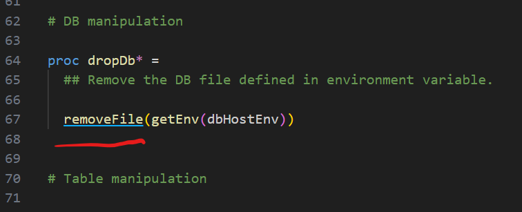
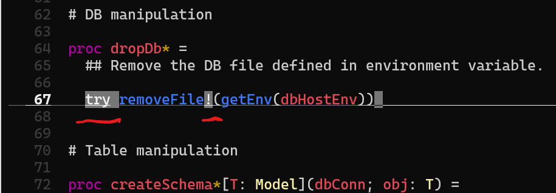

# LSP Server

`nimlangserver` implements the [Language Server Protocol](https://microsoft.github.io/language-server-protocol/) (LSP) and provides Nim language intelligence to editors and IDEs. LSP is the default server mode.

## Contents

<!-- toc -->

## Setup

### VSCode

Install the [vscode-nim](https://github.com/nim-lang/vscode-nim) extension and follow its [setup instructions](https://github.com/nim-lang/vscode-nim#using). The extension bundles both the LSP server and the [MCP server](./mcp.md), including the accompanying skill.

### Sublime Text

Install [LSP-nimlangserver](https://packagecontrol.io/packages/LSP-nimlangserver) from Package Control.

### Zed Editor

Install the [Nim Extension](https://github.com/foxoman/zed-nim) from the Zed Editor extensions panel.

### Helix

Install `nimlangserver` with Nimble and make sure it is on your `PATH`. No additional configuration is needed.

Verify the setup:

```shell
$ hx --health nim
Configured language servers:
  ✓ nimlangserver: /home/username/.nimble/bin/nimlangserver
  Configured debug adapter: None
  Configured formatter:
    ✓ /home/username/.nimble/bin/nph
    Tree-sitter parser: ✓
    Highlight queries: ✓
    Textobject queries: ✓
    Indent queries: ✓
```

### Neovim (lspconfig)

Install [nvim-lspconfig](https://github.com/neovim/nvim-lspconfig) via your plugin manager and add to your `init.vim`:

```lua
lua <<EOF

require'lspconfig'.nim_langserver.setup{
  settings = {
    nim = {
      nimsuggestPath = "~/.nimble/bin/nimsuggest"
    }
  }
}

EOF
```

Defaults work for most users — you likely don't need to set `nimsuggestPath` at all. See the `lspconfig` documentation for key-binding and autocompletion setup.

### VIM / Neovim (coc.nvim)

[coc.nvim](https://github.com/neoclide/coc.nvim) supports both Vim and Neovim and uses a VSCode-like `coc-settings.json`. Install the plugin, then create `coc-settings.json` alongside your `init.vim`:

```json
{
  "languageserver": {
    "nim": {
      "command": "nimlangserver",
      "filetypes": ["nim"],
      "trace.server": "verbose",
      "settings": {
        "nim": {
          "nimsuggestPath": "~/.nimble/bin/nimsuggest"
        }
      }
    }
  }
}
```

### Emacs

Install [lsp-mode](https://github.com/emacs-lsp/lsp-mode) and `nim-mode` from MELPA, then add to your config:

```elisp
(add-hook 'nim-mode-hook #'lsp)
```

## Supported LSP features

- Initialize
- Completions
- Hover
- Goto definition
- Goto declaration
- Goto type definition
- Document symbols
- Find references
- Code actions
- Prepare rename
- Rename symbols
- Inlay hints
- Signature help
- Document formatting (requires `nph` on `PATH`)
- Execute command
- Workspace symbols
- Document highlight
- Shutdown
- Exit

## Configuration

LSP configuration is supplied by the client/editor via `nim.*` settings.

| Setting                       | Description                                                                                                                      |
| ----------------------------- | -------------------------------------------------------------------------------------------------------------------------------- |
| `nim.projectMapping`          | Map file path patterns to `nimsuggest` project roots.                                                                            |
| `nim.timeout`                 | Request timeout in ms before `nimlangserver` restarts. Default: 2 minutes.                                                       |
| `nim.nimsuggestPath`          | Path to `nimsuggest`. Default: `"nimsuggest"`.                                                                                   |
| `nim.autoCheckFile`           | Check the file on the fly.                                                                                                       |
| `nim.autoCheckProject`        | Check the project after saving.                                                                                                  |
| `nim.autoRestart`             | Auto-restart `nimsuggest` once after a crash. The server won't restart if there were no successful calls since the last restart. |
| `nim.workingDirectoryMapping` | Configure the working directory for specific projects.                                                                           |
| `nim.checkOnSave`             | Check the file on save.                                                                                                          |
| `nim.logNimsuggest`           | Enable `nimsuggest` logging.                                                                                                     |
| `nim.inlayHints`              | Configure inlay hints.                                                                                                           |
| `nim.notificationVerbosity`   | Notification verbosity: `"none"`, `"error"`, `"warning"`, or `"info"`.                                                           |
| `nim.formatOnSave`            | Format on save (requires `nph` on `PATH`).                                                                                       |
| `nim.nimsuggestIdleTimeout`   | Timeout in ms before an idle `nimsuggest` is stopped. Default: 120 seconds.                                                      |
| `nim.useNimCheck`             | Use `nim check` instead of `nimsuggest` for linting. Default: `true`.                                                            |
| `nim.maxNimsuggestProcesses`  | Maximum number of live `nimsuggest` processes. `0` means unlimited. Default: `0`.                                                |

### Project mapping example

```json
{
    "nim.projectMapping": [{
        "projectFile": "tests/all.nim",
        "fileRegex": "tests/.*\\.nim"
    }, {
        "projectFile": "main.nim",
        "fileRegex": ".*\\.nim"
    }]
}
```

When inside a Nimble project, `nimble` drives the entry points for `nimsuggest` automatically.

## Inlay hints

Inlay hints are visual snippets displayed inline by the editor to provide context without cluttering the source.

`nimlangserver` provides three kinds:

- **Type hints** — show inferred variable types.
- **Exception hints** — highlight functions that raise exceptions.
- **Parameter hints** — show parameter names at call sites. _(Not yet implemented — see [issue #183](https://github.com/nim-lang/langserver/issues/183).)_

### Screenshots

VSCode:

- Type hint: 
- Exception hint: 

Helix:

- 
- 

### Enabling hints in VSCode

Inlay hints are enabled by default. To toggle individual kinds:

1. Open **Settings**.
2. Search for **inlay**.
3. Navigate to **Nim configuration**.


### Enabling hints in Neovim

```lua
lua << EOF

lspconfig.nim_langserver.setup({
  settings = {
    nim = {
      inlayHints = {
        typeHints = true,
        exceptionHints = true,
        parameterHints = true,
      }
    }
  },

  on_attach = function(client, bufnr)
    if client.server_capabilities.inlayHintProvider then
       vim.lsp.inlay_hint.enable(true, { bufnr = bufnr })
    end
  end
})

EOF
```

For Vim with `coc.nvim`, use the coc configuration block shown in the [VIM/Neovim setup](#vimneovim-cocnvim) section above.

### Enabling hints in Helix

Add to your `languages.toml`:

```toml
[language-server.nimlangserver.config.nim]
inlayHints = { typeHints = true, exceptionHints = true, parameterHints = true }
```

## Extension methods

In addition to the standard LSP methods, `nimlangserver` provides Nim-specific extensions.

### `extension/macroExpand`

Expands a macro or template at a given position.

**Request:**

```nim
type
  ExpandTextDocumentPositionParams* = ref object of RootObj
    textDocument*: TextDocumentIdentifier
    position*: Position
    level*: Option[int]
```

- `position` — cursor position in the document.
- `textDocument` — the document.
- `level` — how many expansion levels to apply.

**Response:**

```nim
type
  ExpandResult* = ref object of RootObj
    range*: Range
    content*: string
```

- `content` — the expanded source.
- `range` — the original range of the unexpanded expression.

**Example:**

```
[Trace - 11:10:09 AM] Sending request 'extension/macroExpand - (141)'.
Params: {
  "textDocument": {
    "uri": "file:///.../tests/projects/hw/hw.nim"
  },
  "position": {
    "line": 27,
    "character": 2
  },
  "level": 1
}

[Trace - 11:10:10 AM] Received response 'extension/macroExpand - (141)' in 309ms.
Result: {
  "range": {
    "start": { "line": 27, "character": 0 },
    "end":   { "line": 28, "character": 19 }
  },
  "content": "  block:\n    template field1(): untyped =\n      a.field1\n\n    template field2(): untyped =\n      a.field2\n\n    field1 = field2"
}
```


