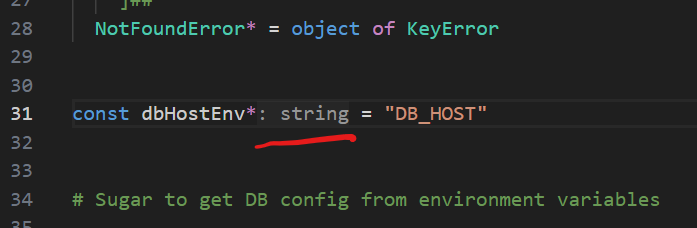
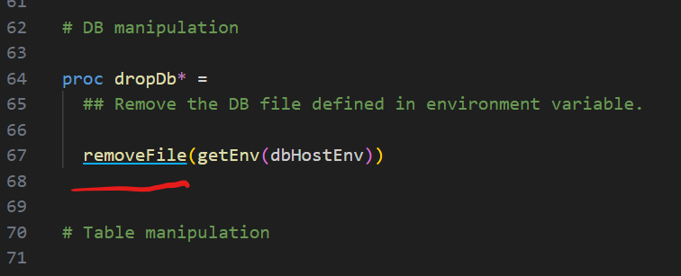
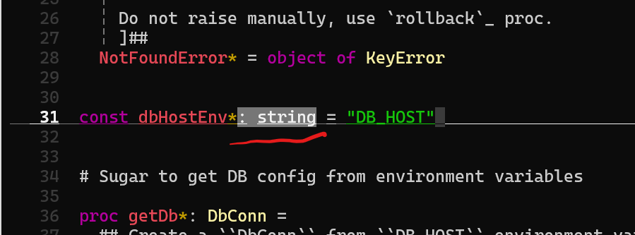
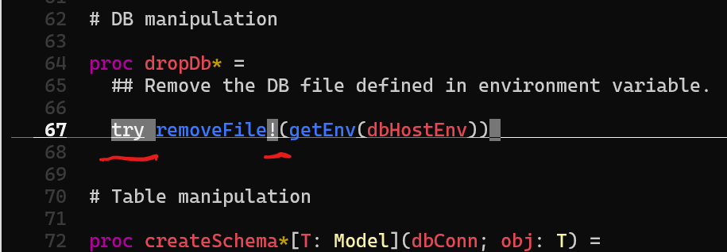
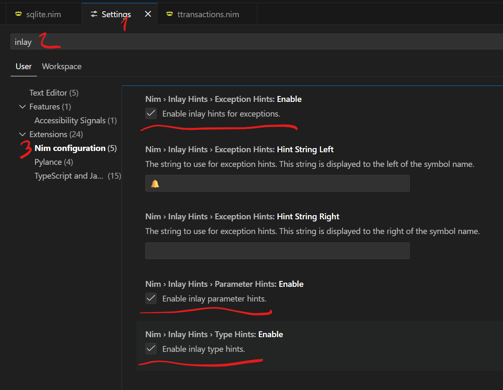

# LSP Server

`nimlangserver` implements the [Language Server Protocol](https://microsoft.github.io/language-server-protocol/) (LSP) and provides Nim language intelligence to editors and IDEs. LSP is the default server mode.

## Contents

<!-- toc -->

## Setup

### VSCode

Install the [vscode-nim](https://github.com/nim-lang/vscode-nim) extension and follow its [setup instructions](https://github.com/nim-lang/vscode-nim#using). The extension bundles both the LSP server and the [MCP server](./mcp.md), including the accompanying skill.

### Sublime Text

Install [LSP-nimlangserver](https://packagecontrol.io/packages/LSP-nimlangserver) from Package Control.

### Zed Editor

Install the [Nim Extension](https://github.com/foxoman/zed-nim) from the Zed Editor extensions panel.

### Helix

Install `nimlangserver` with Nimble and make sure it is on your `PATH`. No additional configuration is needed.

Verify the setup:

```shell
$ hx --health nim
Configured language servers:
  ✓ nimlangserver: /home/username/.nimble/bin/nimlangserver
  Configured debug adapter: None
  Configured formatter:
    ✓ /home/username/.nimble/bin/nph
    Tree-sitter parser: ✓
    Highlight queries: ✓
    Textobject queries: ✓
    Indent queries: ✓
```

### Neovim (lspconfig)

Install [nvim-lspconfig](https://github.com/neovim/nvim-lspconfig) via your plugin manager and add to your `init.vim`:

```lua
lua <<EOF

require'lspconfig'.nim_langserver.setup{
  settings = {
    nim = {
      nimsuggestPath = "~/.nimble/bin/nimsuggest"
    }
  }
}

EOF
```

Defaults work for most users — you likely don't need to set `nimsuggestPath` at all. See the `lspconfig` documentation for key-binding and autocompletion setup.

### VIM / Neovim (coc.nvim)

[coc.nvim](https://github.com/neoclide/coc.nvim) supports both Vim and Neovim and uses a VSCode-like `coc-settings.json`. Install the plugin, then create `coc-settings.json` alongside your `init.vim`:

```json
{
  "languageserver": {
    "nim": {
      "command": "nimlangserver",
      "filetypes": ["nim"],
      "trace.server": "verbose",
      "settings": {
        "nim": {
          "nimsuggestPath": "~/.nimble/bin/nimsuggest"
        }
      }
    }
  }
}
```

### Emacs

Install [lsp-mode](https://github.com/emacs-lsp/lsp-mode) and `nim-mode` from MELPA, then add to your config:

```elisp
(add-hook 'nim-mode-hook #'lsp)
```

## Supported LSP features

- Initialize
- Completions
- Hover
- Goto definition
- Goto declaration
- Goto type definition
- Document symbols
- Find references
- Code actions
- Prepare rename
- Rename symbols
- Inlay hints
- Signature help
- Document formatting (requires `nph` on `PATH`)
- Execute command
- Workspace symbols
- Document highlight
- Shutdown
- Exit

## Configuration

LSP configuration is supplied by the client/editor via `nim.*` settings.

| Setting                       | Description                                                                                                                      |
| ----------------------------- | -------------------------------------------------------------------------------------------------------------------------------- |
| `nim.projectMapping`          | Map file path patterns to `nimsuggest` project roots.                                                                            |
| `nim.timeout`                 | Request timeout in ms before `nimlangserver` restarts. Default: 2 minutes.                                                       |
| `nim.nimsuggestPath`          | Path to `nimsuggest`. Default: `"nimsuggest"`.                                                                                   |
| `nim.autoCheckFile`           | Check the file on the fly.                                                                                                       |
| `nim.autoCheckProject`        | Check the project after saving.                                                                                                  |
| `nim.autoRestart`             | Auto-restart `nimsuggest` once after a crash. The server won't restart if there were no successful calls since the last restart. |
| `nim.workingDirectoryMapping` | Configure the working directory for specific projects.                                                                           |
| `nim.checkOnSave`             | Check the file on save.                                                                                                          |
| `nim.logNimsuggest`           | Enable `nimsuggest` logging.                                                                                                     |
| `nim.inlayHints`              | Configure inlay hints. Exception hints are off by default due to their compile-time cost.                                        |
| `nim.notificationVerbosity`   | Notification verbosity: `"none"`, `"error"`, `"warning"`, or `"info"`.                                                           |
| `nim.formatOnSave`            | Format on save (requires `nph` on `PATH`).                                                                                       |
| `nim.nimsuggestIdleTimeout`   | Timeout in ms before an idle `nimsuggest` is stopped. Default: 120 seconds.                                                      |
| `nim.useNimCheck`             | Use `nim check` instead of `nimsuggest` for linting. Default: `true`.                                                            |
| `nim.maxNimsuggestProcesses`  | Maximum number of live `nimsuggest` processes. `0` means unlimited. Default: `0`.                                                |
| `nim.nimsuggestTimeout`       | Timeout in ms for the `nimsuggest` startup + initial compilation. Default: 60 seconds.                                           |

### Project mapping example

```json
{
    "nim.projectMapping": [{
        "projectFile": "tests/all.nim",
        "fileRegex": "tests/.*\\.nim"
    }, {
        "projectFile": "main.nim",
        "fileRegex": ".*\\.nim"
    }]
}
```

When inside a Nimble project, `nimble` drives the entry points for `nimsuggest` automatically.

### Multi-entry-point projects

Some Nim packages have several independent entry points. For example, [Chronos](https://github.com/status-im/nim-chronos) has a main module `chronos.nim`, while also providing separate application modules that import only a subset of the package. [Constantine](https://github.com/mratsim/constantine) has a similar layout, with several public API modules rather than one module that reaches all of the package.

For these projects, the file being edited is not always the right `nimsuggest` project root. Without a mapping, `nimlangserver` falls back to the opened file, i.e. every opened file is a project root. Nimsuggest will then analyse that file and its imports, but it will not see independent entry points that use the file. This is especially important for generic code: the exact overload may only be known from a concrete instantiation in another entry point.

Use `nim.projectMapping` to select the entry point whose compilation context matches the files being edited:

```json
{
  "nim.projectMapping": [
    {
      "projectFile": "chronos/apps/http/httpclient.nim",
      "fileRegex": "^chronos/apps/http/.*\\.nim$"
    },
    {
      "projectFile": "chronos.nim",
      "fileRegex": "^chronos/.*\\.nim$"
    }
  ]
}
```

Mappings are checked in order, so put more specific patterns first. Paths in `projectFile` and `fileRegex` are relative to the workspace root. The mapped file must exist and be a compilable Nim entry point; a mapping does not import modules or create generic instantiations by itself.

#### Chronos

The core entry point is `chronos.nim`, but the HTTP application modules are independent entry points. Mapping HTTP sources to `httpclient.nim` gives nimsuggest the context of the HTTP implementation, while other Chronos files use the core entry point.

#### Constantine

Map each source area to an existing public API module that actually exercises the code being edited. For example, elliptic-curve sources can use a suitable elliptic-curve API entry point:

```json
{
  "nim.projectMapping": [
    {
      "projectFile": "constantine/ethereum_bls_signatures.nim",
      "fileRegex": "^constantine/math/elliptic/.*\\.nim$"
    },
    {
      "projectFile": "constantine/ethereum_bls_signatures.nim",
      "fileRegex": "^constantine/.*\\.nim$"
    }
  ]
}
```

The best root depends on the API area. If no existing entry point exercises the required combinations, create a project-local analysis root that imports representative public APIs and, where necessary, contains representative concrete uses. Keep that file as tooling infrastructure rather than treating it as a public package entry point.

#### Project-local editor configuration

The setting is supplied by the editor's LSP client. For Helix, a project-local `.helix/languages.toml` can contain:

```toml
[language-server.nimlangserver.config.nim]
projectMapping = [
  { projectFile = "chronos/apps/http/httpclient.nim", fileRegex = "^chronos/apps/http/.*\\.nim$" },
  { projectFile = "chronos.nim", fileRegex = "^chronos/.*\\.nim$" },
]
```

For VS Code, put the equivalent JSON setting in the project's `.vscode/settings.json`. Other editors expose the same `nim.projectMapping` setting through their LSP client configuration.

Project mapping is not required for ordinary definitions or every generic lookup. It is needed when precise results depend on a concrete instantiation reachable only from another entry point. Nimsuggest can perform conservative speculative analysis when no instantiation is available, but it cannot infer uses that are outside the selected compilation context.

## Inlay hints

Inlay hints are visual snippets displayed inline by the editor to provide context without cluttering the source.

`nimlangserver` provides three kinds:

- **Type hints** — show inferred variable types.
- **Exception hints** — highlight functions that raise exceptions. Disabled by default: enabling them significantly slows down `nimsuggest` startup (see the performance note below).
- **Parameter hints** — show parameter names at call sites. _(Not yet implemented — see [issue #183](https://github.com/nim-lang/langserver/issues/183).)_

### Performance note

Exception hints are disabled by default because of their compile-time cost: when enabled, `nimlangserver` starts `nimsuggest` with `--exceptionInlayHints:on`, which makes the compiler track raised and caught exceptions for every routine and record per-symbol exception information while it compiles the project. On large projects this multiplies the initial compilation time—measured at more than 4x on nimbus-eth1 (about 100 seconds without the hints, still unfinished after 7 minutes with them). The cost is in the Nim compiler itself and may be reduced in the future; until then, enable `nim.inlayHints.exceptionHints.enable` only if you are willing to accept the slower startup.

### Screenshots

VSCode:

- Type hint: 
- Exception hint: 

Helix:

- 
- 

### Enabling hints in VSCode

Type and parameter hints are enabled by default; exception hints are disabled by default (see the performance note above). To toggle individual kinds:

1. Open **Settings**.
2. Search for **inlay**.
3. Navigate to **Nim configuration**.



### Enabling hints in Neovim

```lua
lua << EOF

lspconfig.nim_langserver.setup({
  settings = {
    nim = {
      inlayHints = {
        typeHints = true,
        exceptionHints = true,
        parameterHints = true,
      }
    }
  },

  on_attach = function(client, bufnr)
    if client.server_capabilities.inlayHintProvider then
       vim.lsp.inlay_hint.enable(true, { bufnr = bufnr })
    end
  end
})

EOF
```

For Vim with `coc.nvim`, use the coc configuration block shown in the [VIM/Neovim setup](#vimneovim-cocnvim) section above.

### Enabling hints in Helix

Add to your `languages.toml`:

```toml
[language-server.nimlangserver.config.nim]
inlayHints = { typeHints = true, exceptionHints = true, parameterHints = true }
```

## Extension methods

In addition to the standard LSP methods, `nimlangserver` provides Nim-specific extensions.

### `extension/macroExpand`

Expands a macro or template at a given position.

**Request:**

```nim
type
  ExpandTextDocumentPositionParams* = ref object of RootObj
    textDocument*: TextDocumentIdentifier
    position*: Position
    level*: Option[int]
```

- `position` — cursor position in the document.
- `textDocument` — the document.
- `level` — how many expansion levels to apply.

**Response:**

```nim
type
  ExpandResult* = ref object of RootObj
    range*: Range
    content*: string
```

- `content` — the expanded source.
- `range` — the original range of the unexpanded expression.

**Example:**

```
[Trace - 11:10:09 AM] Sending request 'extension/macroExpand - (141)'.
Params: {
  "textDocument": {
    "uri": "file:///.../tests/projects/hw/hw.nim"
  },
  "position": {
    "line": 27,
    "character": 2
  },
  "level": 1
}

[Trace - 11:10:10 AM] Received response 'extension/macroExpand - (141)' in 309ms.
Result: {
  "range": {
    "start": { "line": 27, "character": 0 },
    "end":   { "line": 28, "character": 19 }
  },
  "content": "  block:\n    template field1(): untyped =\n      a.field1\n\n    template field2(): untyped =\n      a.field2\n\n    field1 = field2"
}
```
