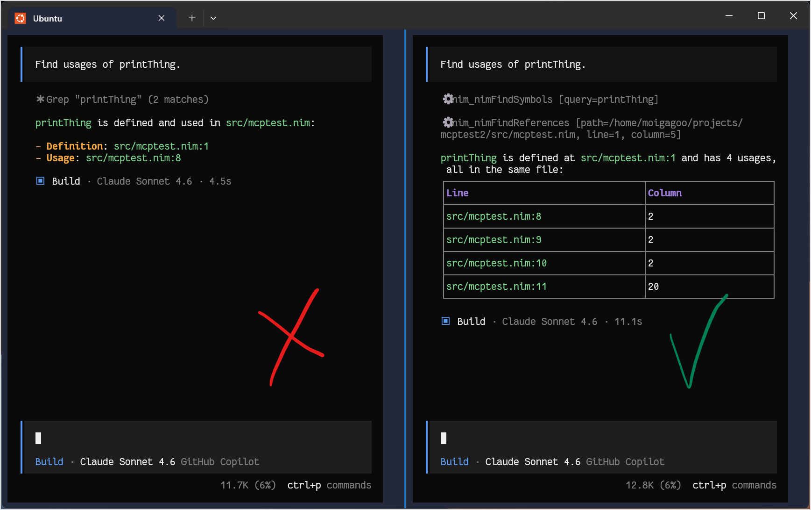

# MCP Server

`nimlangserver` can run as an [MCP (Model Context Protocol)](https://modelcontextprotocol.io/) server, exposing Nim-aware tools to AI assistants and coding agents such as GitHub Copilot, Claude Code, and Gemini. This lets AI tools inspect Nim code semantically instead of relying on plain-text search.

## Contents

<!-- toc -->

## Setup

To use `nimlangserver` as an MCP server in a Nim project:

1. [Install `nimlangserver`](./quickstart.md#installation).
2. Copy the matching MCP config file from this repository to your project:

   | Agent                   | Config file             |
   | ----------------------- | ----------------------- |
   | VSCode / GitHub Copilot | `.vscode/mcp.json`      |
   | Claude Code             | `.mcp.json`             |
   | GitHub Copilot CLI      | `.mcp.json`             |
   | Gemini CLI              | `.gemini/settings.json` |
   | OpenCode                | `opencode.json`         |

3. Copy the `SKILL.md` file to your project:

   | Agent                   | Destination                       |
   | ----------------------- | --------------------------------- |
   | VSCode / GitHub Copilot | `.github/skills/nim-mcp-tools/`   |
   | Claude Code             | `.claude/skills/nim-mcp-tools/`   |
   | GitHub Copilot CLI      | `.github/skills/nim-mcp-tools/`   |
   | Gemini CLI              | `.gemini/skills/nim-mcp-tools/`   |
   | OpenCode                | `.opencode/skills/nim-mcp-tools/` |

4. Open the Nim project root in your AI tool.

## Available tools

| Tool                | Description                                          |
| ------------------- | ---------------------------------------------------- |
| `nimFindReferences` | Find all references to a symbol at a given position. |
| `nimFindSymbols`    | Search workspace symbols by name query.              |
| `nimListSymbols`    | List all symbols defined in a file.                  |
| `nimCheckProject`   | Run diagnostics for the whole project.               |
| `nimCheckFile`      | Run diagnostics for a single file.                   |

## Usage

Before using the MCP tools, load the skill with the `/nim-mcp-tools` slash command in your AI tool.

With the skill loaded, your AI tool will automatically prefer Nim-specific MCP tools over general-purpose tools like `grep` when working with Nim code.

**Example:** if you ask your AI to find and remove all references to a symbol `foo`, it will:

1. Call `nimFindSymbols("foo")` to locate all definitions.
2. Call `nimFindReferences` on each definition.
3. Perform the deletion.

You can also invoke tools directly: _"Call `nimCheckFile` on `@myfile.nim`."_

### Demo

- [Presentation at the IFT Townhall meetup →](https://www.youtube.com/live/OZ3PR_U2QMo?si=5BEvawshJpAUY37o&t=2107)


## Why use nimlangserver as an MCP server?

Nim's identifier resolution is not purely textual — the same symbol can be spelled differently (`printThing`, `printthing`, `print_thing`) and can be called indirectly through templates or macros. Plain text search misses these cases.

Consider:

```nim
proc printThing(thing: string) =
  echo thing

template doActionWithThing(action: untyped, thing: string): untyped =
  `action Thing`(thing)

when isMainModule:
  printThing("Hello")
  printthing("World")
  print_thing("Nim is awesome")
  doActionWithThing(print, "No really, Nim is so cool")
```

`printThing` is used 4 times: directly, twice with alternative spelling, and once through a template. Without MCP, an AI relying on text search misses 3 of those 4 usages. With MCP and `nimFindSymbols` + `nimFindReferences`, all 4 are found reliably.



With MCP, the result is _guaranteed_ to be correct because it uses the same semantic analysis that the compiler uses.
